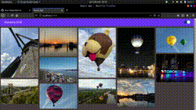

<h1 align="center">
  Theme Switch
  
</h1>

  <a href="#-tecnologias">Tecnologias</a>&nbsp;&nbsp;&nbsp;|&nbsp;&nbsp;&nbsp;
  <a href="#-projeto">Projeto</a>&nbsp;&nbsp;&nbsp;|&nbsp;&nbsp;&nbsp;
  <a href="#memo-licença">Licença</a>

  

 

## 🚀 Tecnologias

Esse projeto foi desenvolvido com as seguintes tecnologias:

- HTML
- Styled-Components
- TypeScript
- React
- Polished

## 💻 Projeto

O ThemeSwitch é uma aplicação simples para estudar as funcionalidades do styled-components e com isso fazer um pequeno switch de temas e para aproveitar utilizar a tecnica de Mansory Grid criada pelo Printrest

##  Licença

Esse projeto está sob a licença MIT. Veja o arquivo [LICENSE](.github/LICENSE.md) para mais detalhes.

---

Feito com ♥ por Paulo Campos em conjunto com a Rocketseat [Participe da  comunidade!](https://discordapp.com/invite/gCRAFhc)
